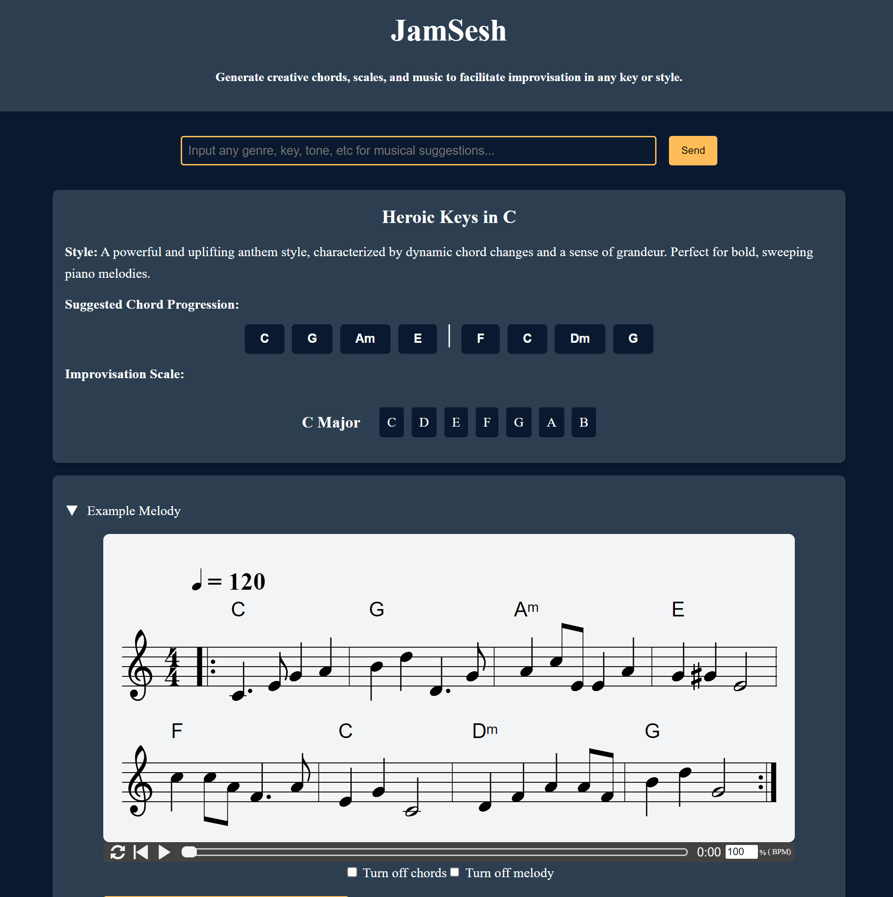

# JamSesh: Facilitate Improvisation utilizing Large Language Models

Intermediate musicians struggle daily to come up with new muscial progrssions to effectively start a jam. Wheather you are a piano soloist, or playing with friends, it is nice to have some guidence for your musical session, such as chords and scales, without relying on learning exciting songs.

JamSesh explores the use of LLMs to generate music chord progressions, scales, and example music based off of simple plain language prompts in order to facilite this improvisation. People have been looking into various ways to generate music from text using multimodel feature spaces, yet there is curiousity about how well a purely language based approach may work

## Project Overview

It was found that with careful prompt engineering, LLMs can understand and produce texted-based music at a rudimentary level. Using this, JamSesh incorporated GPT4 in to a working pipeline along with curing a synthetic dataset for model finetuning. 

The Next.js frontend consistently recieves a JSON of formatted results to display a chord progression, improvisation scale, and example song based on a simple text input.

## Data Generation

Traditional music datasets lack necessary input-output pairs, including chords and scales, along with corresponding genre and style metadata, making them challenging to use for this task. To overcome this, JamSesh utilizes OpenAI's GPT4 to generate results based on various inputs and prompts.

The format used to process the music is [ABC notation](https://notabc.app/abc/). This string-based music format is great for LLM understanding. The main use of this notation is for traditional and folk music though meaning that a few examples needed to be created in Jazz or Rock, JamSesh's main two genres in order build ground truth input/output pairs.

I curated a few example samples using resources on jazz and piano improvisation techinuqes found through the Duke Music Library. Using those examples I both generated synthetic data for supervised fine tuning along with building a pipeline with GPT4.

### Prompt Engineering

Prompt engineering was pivotal for this project. I utilized basic chain of thought techniques by explaining ABC notation and what needed to be generated along with extensive few-shot prompt examples. The specific prompts can be found in `backend/gpt_utils.py`. 

The output that was needed from the model for JamSesh looked like this:

```json
{
  "input": "{prompt}",
  "output": {
    "chords": "## Suggested chord progression",
    "scales": "## Suggested scale for improvising",
    "title": "## Title of Jam",
    "style": "## Style to play like",
    "example": "## ABC notation for an example section using these chords and notes"
  }
}
```

## Model Pipelines

### Finetuning

Using 100+ input / output samples from GPT, I was able to finetune Mistral-7B-instruct for this specific music generation use case.

I found that after converge, the model would format the responses correctly in the expected json format, yet would have poor music often breaking basic music rules. 

I believe there is improvement to be made in finetuning smaller models on music text, yet it requires a large amount of real, curated data instead of a small amount of synthetic data.

### Final pipeline

GPT4 with careful, fewshot prompting with real muscial examples performed very well for me. I found that 98% of the time the model returned in the exact format I needed to the frontend app. I also found that the suggested chords and scale always are in the same key. Also the flexibilty of the prompting allowed for new endpoints to be implemented such as melody regeneration and harmony generation without too much adaptation.

While the results were coherent musically and baed on the text prompt, they were often repetetive and basic showing that there is a lot more improvement to be made in utilizing a language based approach for musical generation.

## Application

App is currently hosted in Azure Containers [here](https://jamsesh-frontend.whitedune-f3f31647.eastus.azurecontainerapps.io/)



To run JamSesh locally:
1. Configure and install Docker
2. `docker-compose up --build`

## Repo Structure

```
├── backend/
   ├── server.py                # Flask server
   ├── hf_utils.py              # Script to access hf endpoint
   └── gpt_utils.py             # script for carefully prompting gpt4
├── frontend/
   ├── pages/                   # React pages
   ├── styles/                  # css styling
   └── components/              # React components for UI
├── data/
   ├── scripts/                 # Scripts to generate and process data
   └── sft_jsons/               # JSON files used for sft
├── modeling/
   ├── jamsesh_training.ipynb   # Notebook for training models
   ├── handler.py               # Handler for deploying finetuned llm to huggingface│   
   └── traditional_model.md     # Explanation of traditional music generation models
└──docker-compose.yml           # Build and config both frontend and backend docker images
```

## Technologies Used
- **Next.js**:
    - **ABCjs**: To display music notations, integrated within React.
- **Python**:
    - **LitGPT**: Pytorch lightning package to help finetune LLMs
    - **Flask**: To run backend server
- **LLMs**
    - **OpenAI GPT4**: For data generation and main pipeline
    - **Mistral-7B-instruct**:  Smaller model for fine-tuning


## Additional Information

For those interested in learning more about the project can contact me at michael.keohane@duke.edu or connect [here](https://www.linkedin.com/in/mike-b-k/)
